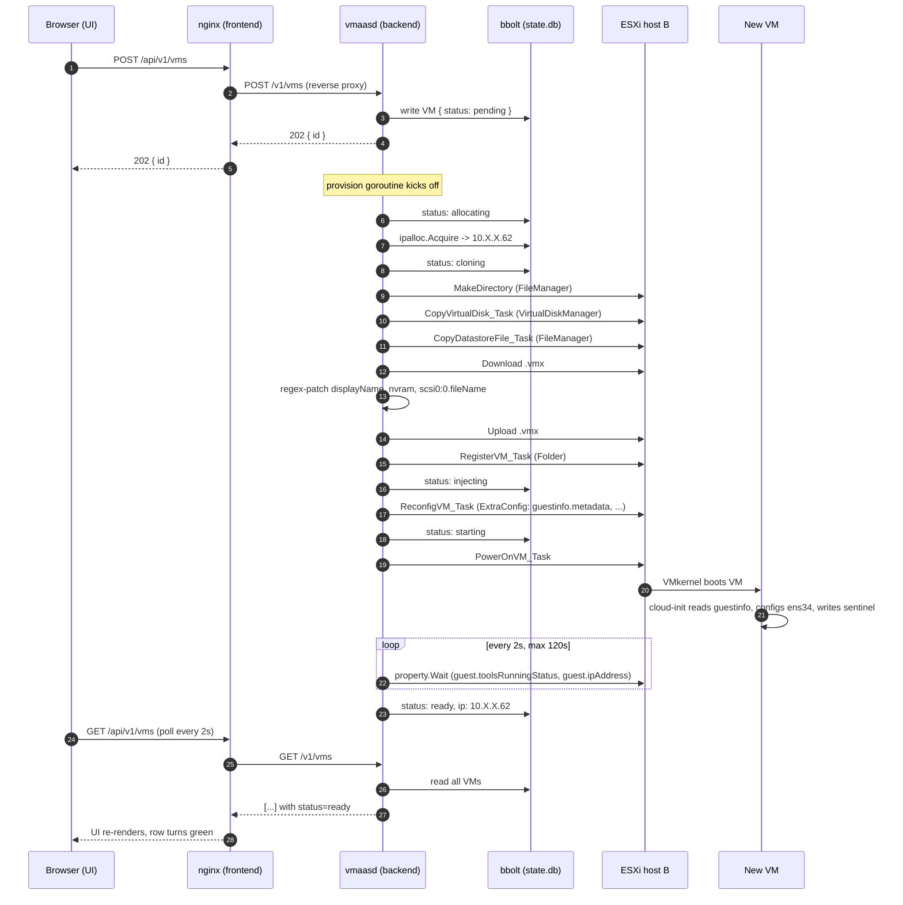

# Architecture

Read this after the [README](README.md). It explains **what each piece
does and why it exists**. The [HOW_IT_WORKS](docs/HOW_IT_WORKS.md)
companion doc walks through a single request end-to-end if you'd rather
learn by following data.

## The big picture



## Module map

Each module is one Go package under `backend/internal/`.

| Module        | Responsibility                                                                 | Key types                                |
| ------------- | ------------------------------------------------------------------------------ | ---------------------------------------- |
| `config`      | Load YAML, expand `${ENV}`, validate.                                          | `Config`, `ESXiConfig`, `NetworkConfig`  |
| `esxi`        | govmomi wrapper. Holds the session, finder, and cached object references.     | `Client`, datastore + VM helpers         |
| `clone`       | The 5-step file-level clone (idempotent via store checkpoints).               | `Request`, `Clone()`, `Patch(vmx, name)` |
| `cloudinit`   | Render `metadata.yaml` + `userdata.yaml` from templates, base64-encode them.  | `Renderer`, `Vars`                       |
| `ipalloc`     | bbolt-backed bitmap allocator over a static pool.                              | `Allocator`, `ErrPoolExhausted`          |
| `store`       | bbolt schema: VM records, IP allocations, clone checkpoints.                  | `Store`, `VM`, `Status`                  |
| `lifecycle`   | Orchestrator + state machine. The brains of provisioning + deletion.          | `Orchestrator`, `CreateRequest`          |
| `api`         | HTTP layer (chi). Auth, logging, CORS, embedded UI, route handlers.           | `Server`, handlers                       |

### Why the split?

The hard parts of this system are **stateful and crash-recoverable**:
five SOAP calls can fail at any point, and we need to know exactly
where to resume or what to clean up. Pushing state into one place
(`store`) and one state machine (`lifecycle`) — instead of scattering it
through HTTP handlers — keeps the crash story simple.

`esxi`, `clone`, `cloudinit`, and `ipalloc` are deliberately
side-effect-only wrappers over their respective concerns. They take a
context, do a thing, return an error. The orchestrator is the only
piece that knows the order of operations.

## Storage layout (`bbolt`)

bbolt is a single-file embedded KV store. We use three buckets:

```
state.db
├── vms          { vm-id → JSON-encoded VM record }
├── ipalloc      { ip → vm-id }
└── clones       { "<vm-id>:<step>" → "done" }   // checkpoints
```

The `clones` bucket is what makes provisioning **idempotent**: each step
of the clone (mkdir, copy vmdk, copy vmx, patch vmx, register) writes
its name to this bucket before continuing. On restart, the orchestrator
re-enters `runProvision` for any VM that wasn't yet `ready` or `failed`
and `clone.Clone` skips steps whose checkpoint is already set.

## State machine

```
                                       ┌────────┐
                                       │ failed │
                                       └────────┘
                                           ▲
                                           │ (any error)
                                           │
pending ─► allocating ─► cloning ─► injecting ─► starting ─► ready
                │             │           │           │
                └─────────────┴───────────┴───────────┘
                              │
                              ▼ (Delete)
                          deleting
                              │
                              ▼
                          (record removed, IP freed)
```

Transitions are persisted before the next step starts. The orchestrator
never reads "live" status from ESXi — it owns the canonical state.

## Networking choices

- **`network_mode: host` on the backend.** The backend container reuses
  the host's routing table, so whatever path the host already has to
  the ESXi management address (direct, routed, tunneled, doesn't matter)
  is the same path the backend gets -- no docker-bridge gymnastics.
- **Nginx in front of the backend.** Tackles two annoyances at once:
  CORS goes away (everything is same-origin via `/api/`), and the UI
  can be served independently from the backend on port 8081.
- **Public DNS for the VMs by default.** cloud-init configures `1.1.1.1`
  and `8.8.8.8`. If your environment's internal resolver isn't reachable
  from the VM network (a common case with nested networks), public
  resolvers keep `apt update` and the rest working without extra setup.
  Override `network.dns` in `vmaas.yaml` to point at an internal resolver
  once you've confirmed it's reachable through the VM port group.

## Configuration

`backend/configs/vmaas.yaml` is mounted read-only into the container.
Everything that should change per environment goes through `${ENV}`
substitution — currently `VMAAS_TOKEN` and `ESXI_PASSWORD`. Add new
vars by referencing them in the YAML and listing them in `.env.example`.

## What's intentionally NOT here

- **HA.** Single instance, single bbolt file. If the host dies, the
  service is down. (Inventory in ESXi survives — bbolt just goes stale.)
- **TLS.** The backend listens HTTP only; you reach it through a local
  nginx. Put a real reverse proxy with certs in front if you expose it.
- **vCenter support.** We hand-rolled the clone because the target host
  is standalone. If the host is managed by vCenter, swap
  `clone/clone.go` for a single `CloneVM_Task` call.
- **Multi-host scheduling.** All VMs go on host B. There's no DRS, no
  placement, no balancing. One host, one datastore, one port group.
- **Authn beyond a static bearer token.** Good enough for "personal
  homelab dashboard." Not good enough for anything else.
