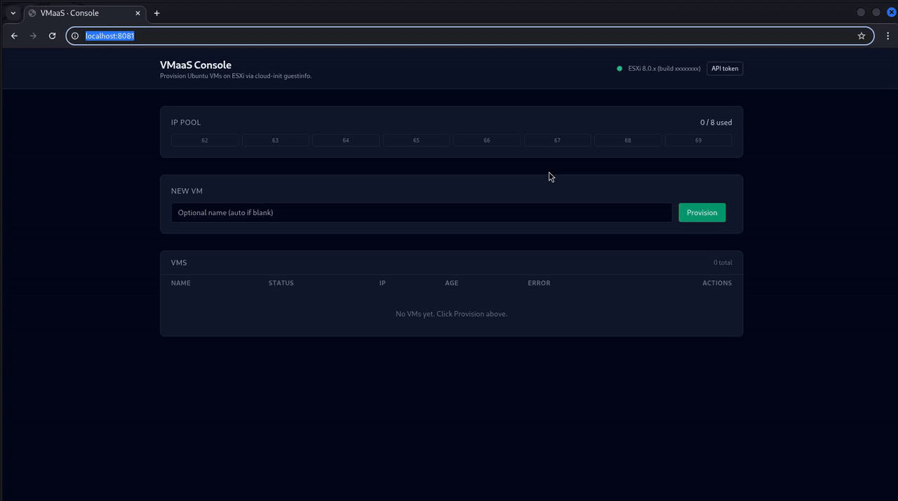

# VMaaS Zero-Touch

> A self-service VM provisioning platform for standalone VMware ESXi.
> One click in the browser, ~60 seconds later you have a fully booted
> Ubuntu VM with a static IP and your SSH key already authorized.

```
+-----------+   HTTP    +---------+   SOAP / govmomi   +--------+
|  Browser  | --------> | vmaasd  | -----------------> |  ESXi  |
|  (UI/JS)  |           |  (Go)   |                    |  host  |
+-----------+           +---------+                    +--------+
                          |   |
              bbolt KV <--+   +--> IP allocator + state machine
```

## Demo



Full provision -> SSH -> delete cycle, ~80 seconds, captured by
[`scripts/record-demo.sh`](scripts/record-demo.sh). Higher quality:
[`docs/demo.mp4`](docs/demo.mp4).

## What it does

You click **Provision** in the web UI. Roughly 60 seconds later:

- A new Ubuntu 22.04 VM exists on your ESXi host.
- It has a static IP from a pool you defined (e.g. `10.X.X.62-69`).
- Your SSH public key is already authorized -- `ssh user@<ip>` just works.
- A sentinel log inside the VM confirms cloud-init ran cleanly.
- Clicking the trash icon powers it off, unregisters it, deletes its
  files from the datastore, and returns the IP to the pool.

## Why it exists

Standalone ESXi is the cheapest path to a real hypervisor for a homelab
or test lab -- but it is missing most of the niceties of vCenter:

- No `CloneVM_Task` (that API is vCenter-only).
- No Distributed Resource Scheduler.
- No inventory hierarchy, no folders-of-folders.
- No central CD/DVD library, no template type for VMs.

This project rebuilds the *"clone a VM, give it a known IP, hand me an
SSH-ready shell"* workflow on top of the primitives that **are**
available on standalone ESXi: datastore file operations, register /
unregister, `extraConfig`, and `PowerOn` -- driven by Go and govmomi.

## Architecture at a glance

| Layer        | Technology                                          |
|--------------|-----------------------------------------------------|
| Frontend     | Vanilla HTML/JS/CSS + Tailwind CDN. **No build step.** |
| API          | Go 1.23, [chi v5](https://github.com/go-chi/chi). Bearer-token auth. |
| Orchestrator | Persisted state machine (8 states), goroutine per provision. |
| ESXi driver  | [govmomi](https://github.com/vmware/govmomi) v0.46.2 |
| Cloning      | 5-step file-level procedure (substitute for `CloneVM_Task`). |
| Cloud-init   | VMware datasource via `guestinfo.*` extraConfig keys. |
| Storage      | [bbolt](https://github.com/etcd-io/bbolt) -- 3 buckets: `vms`, `ipalloc`, `clones`. |
| Packaging    | Multi-stage Docker (distroless/nonroot for the backend), nginx for the frontend. |

Read [ARCHITECTURE.md](ARCHITECTURE.md) for the module map and the
sequence diagram of one provision request.

## Quickstart

### 1. Prerequisites

- Linux host with Docker + the `docker compose` plugin.
- Network reachability from this host to a standalone ESXi 8.x server
  (TCP/443 to the SDK).
- A gold-image VM already registered on that host (default name:
  `ubuntu-22.04-template`) with cloud-init installed, VMware Tools
  running, and one NIC on your VM network.
- Your SSH public key.

### 2. Configure

```sh
git clone https://github.com/IBoutbaoucht/vmaas-zerotouch.git
cd vmaas-zerotouch

cp .env.example .env
$EDITOR .env                                # ESXI_PASSWORD, VMAAS_TOKEN

mkdir -p keys
cp ~/.ssh/id_ed25519.pub keys/authorized_keys
```

Edit `backend/configs/vmaas.yaml` to set:

- `esxi.url` -- e.g. `https://<esxi-host>/sdk`
- `esxi.user` -- typically `root`
- `esxi.gold_vm` -- name of your gold template
- `network.pool` -- IP range, gateway, prefix, DNS
- `network.portgroup` -- VM-network port-group name

### 3. Run

```sh
docker compose up --build -d
```

Open `http://localhost:8081/`, click the **API token** button, paste
the value from `.env`, then **Provision**. The new VM appears in the
table; ~60 seconds later its status flips to `ready` with an IP. From
any host with network reachability:

```sh
ssh <user>@<vm-ip>
```

## Repository layout

```
vmaas-zerotouch/
+-- README.md                # this file
+-- ARCHITECTURE.md          # system map + sequence diagram
+-- docker-compose.yml       # backend (host-net) + frontend (bridge)
+-- Makefile                 # build / up / down / test / e2e / logs
+-- .env.example             # template for ESXI_PASSWORD + VMAAS_TOKEN
|
+-- backend/                 # Go service, ~2100 LoC, 8 internal modules
|   +-- cmd/vmaasd/          # main()
|   +-- internal/
|   |   +-- api/             # HTTP layer (chi, auth, embedded UI)
|   |   +-- lifecycle/       # state machine: provision / delete
|   |   +-- clone/           # 5-step file-level clone procedure
|   |   +-- cloudinit/       # render metadata/userdata, base64
|   |   +-- ipalloc/         # bbolt-backed IP allocator
|   |   +-- esxi/            # govmomi wrapper
|   |   +-- store/           # bbolt schema
|   |   +-- config/          # YAML + env interpolation
|   +-- configs/vmaas.yaml   # runtime config
|   +-- Dockerfile           # multi-stage -> distroless/nonroot
|
+-- frontend/                # static UI, ~300 LoC, no build
|   +-- index.html, app.js, styles.css
|   +-- nginx.conf
|   +-- Dockerfile           # nginx:1.27-alpine
|
+-- docs/
|   +-- HOW_IT_WORKS.md      # one provision request narrated end-to-end
|   +-- TROUBLESHOOTING.md   # the gotchas (sessions, DPG, DNS, ...)
|
+-- scripts/
    +-- e2e.sh               # full create -> ssh -> delete check
    +-- healthcheck.sh
```

## How it works (the short version)

1. `POST /v1/vms` returns `202 Accepted` with a new VM ID. Work runs in
   a goroutine; every state transition is persisted to bbolt so a crash
   mid-provision is resumable.
2. The IP allocator reserves the first free address from the pool in a
   single bbolt transaction.
3. cloud-init metadata + userdata are rendered with `text/template`,
   base64-encoded, and written to four `extraConfig` keys
   (`guestinfo.metadata`, `guestinfo.metadata.encoding`,
   `guestinfo.userdata`, `guestinfo.userdata.encoding`).
4. The clone module synthesises `CloneVM_Task` out of five file-level
   calls: `MakeDirectory`, `CopyVirtualDisk_Task`, `CopyDatastoreFile_Task`,
   download + regex-patch + upload the `.vmx`, and `RegisterVM_Task`.
5. `PowerOn`. Inside the guest, cloud-init detects the VMware datasource,
   applies networking + user setup, and writes
   `/var/log/vmaas-sentinel.log`.
6. The orchestrator waits for VMware Tools to report running, then polls
   for the sentinel via `GuestProcessManager.StartProgram` -- a
   Tools-mediated `cat`. When found: status -> `ready`.
7. On `DELETE`: power off, unregister, delete the datastore directory,
   release the IP back to the pool, all in one persisted sequence.

Read [docs/HOW_IT_WORKS.md](docs/HOW_IT_WORKS.md) for the full narration
with the actual govmomi method names at each step.

## Common commands

```sh
make up              # docker compose up --build -d
make down            # stop the stack
make logs            # tail backend + frontend
make test            # go test ./...
make e2e             # automated full-pipeline check against the stack
make build           # local go build (no docker)
```

## Documentation

- **[ARCHITECTURE.md](ARCHITECTURE.md)** -- module map + sequence
  diagram.
- **[docs/HOW_IT_WORKS.md](docs/HOW_IT_WORKS.md)** -- a single provision
  request, button click to running VM, narrated step-by-step.
- **[docs/TROUBLESHOOTING.md](docs/TROUBLESHOOTING.md)** -- common
  failure modes and how to diagnose them (session leaks, portgroup
  security flags, DNS, etc.).

## Authors

- **Imad**
- **Oussama**

## Status

End-to-end demonstrated against a real homelab hypervisor (ESXi 8.x):
~58 seconds from POST to ssh-ready VM, fully reproducible from a clean
checkout.

## License

MIT -- see [LICENSE](LICENSE).
